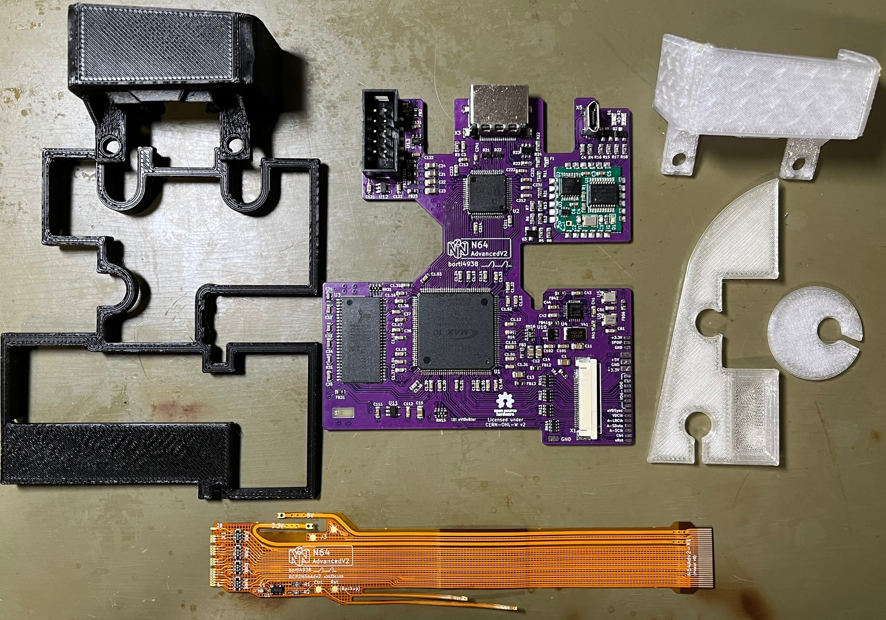
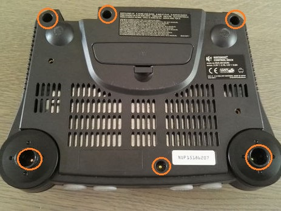
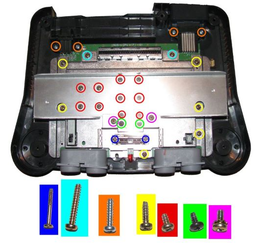
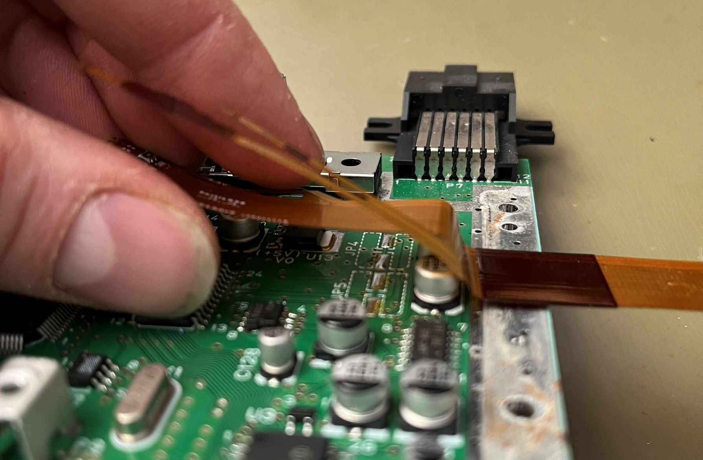
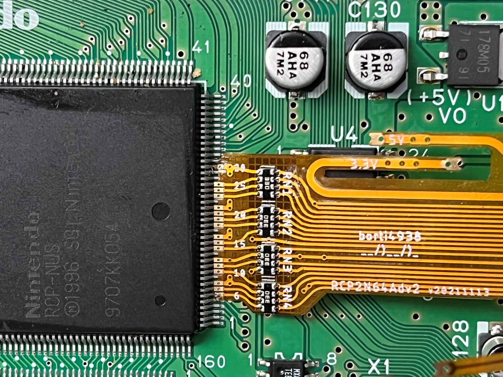
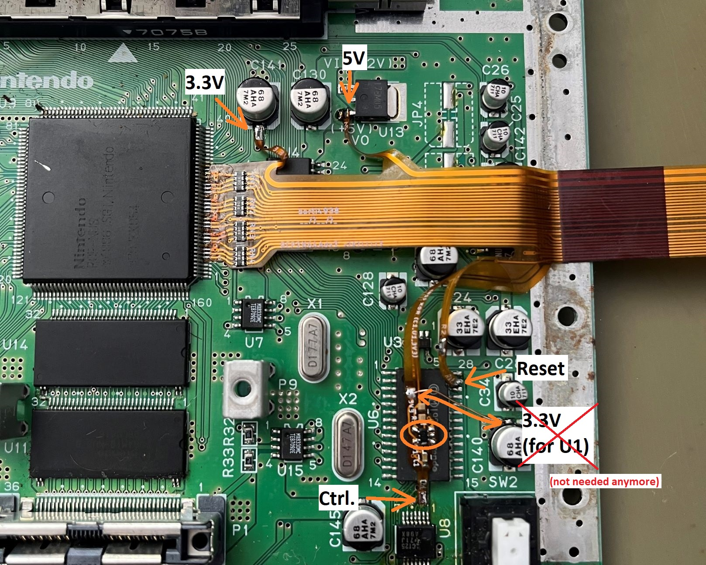
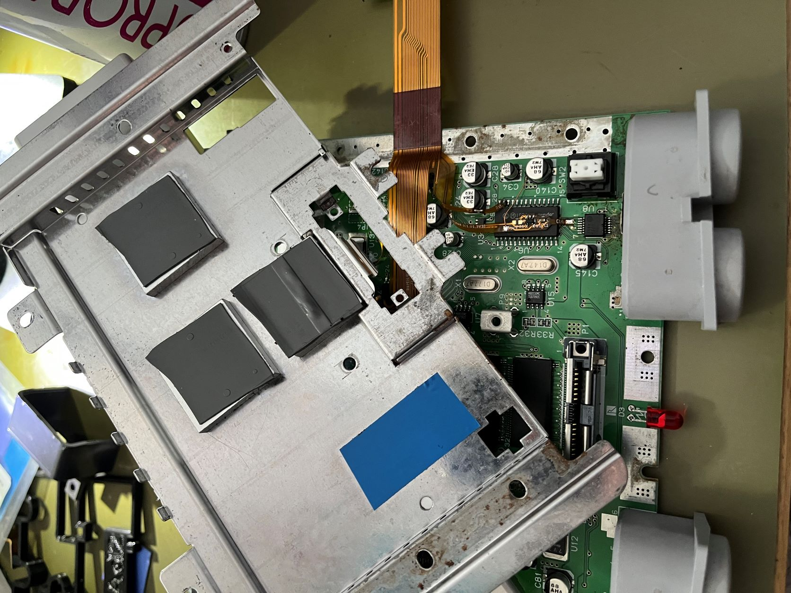
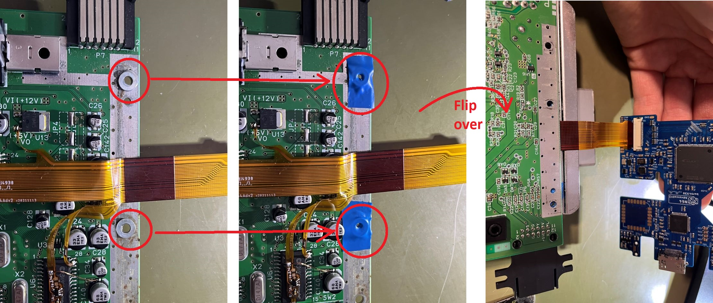
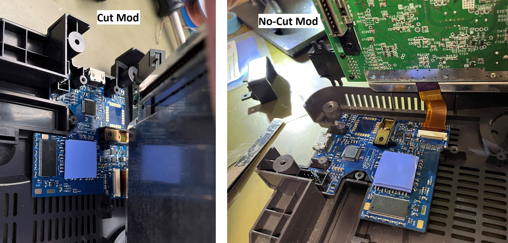

N64 Advanced 2 (PCB)
---

This repository contains all you need files to build your own DIY N64 Advanced board.
Firmware is supplied in another repository.

Please don't ask me for selling a modding.
I either sell some prototypes on some forums marketplaces (which is very unlikely) or I don't have any of the boards.
This is a complete DIY modding project.
Everybody is on his own here.

**WARNING:**
This is an advanced DIY project if you do everything on your own.
You need decent soldering skills.
The FPGA ad Video transmitter have 0.5mm fine pitch with 144pins and 64pins, respectively, and each has an exposed pad below the IC, which has to be soldered to the PCB.
Furthermore, the clocking chip is in a 24-QFN package where the pins are partwise below the IC.
It also has an exposed pad.
Next to it on the board there are some SMD1206 resistor and ferrite bead arrays.

## Table of Contents

- [Checklist](https://github.com/borti4938/n64adv2_pcb#checklist-how-to-build-the-project)
- [Assembly](https://github.com/borti4938/n64adv2_pcb#assembly)
- [Installation](https://github.com/borti4938/n64adv2_pcb#installation)
  - [1. Open the Console](https://github.com/borti4938/n64adv2_pcb#1-open-the-console)
  - [2. Preparation](https://github.com/borti4938/n64adv2_pcb#2-preparation)
  - [3. Solder Work](https://github.com/borti4938/n64adv2_pcb#3-solder-work)
  - [4. Put Everything Together](https://github.com/borti4938/n64adv2_pcb#4-put-everything-together)
- [Jumper Description](https://github.com/borti4938/n64adv2_pcb#jumper-description)

## Checklist: How to build the project

- Use PCB files to order your PCBs. You need the order the main PCB. If you plan to have a clean install, you need to order a flexible PCB, too. You can opt for a fully custom flex-PCB or a partial flex-PCB where you run a FFC cable from flex to main PCB. Important PCB specifications are provided in the [BOM](./doc/n64adv2_BOM.xlsx).
  - Main PCB: either [KiCAD-PCB design file](./pcbs/main/n64adv2.kicad_pcb) or [Gerber files](./gerber/main/)
  - Full Flex PCB: either [EAGLE-PCB design file](./pcbs/flex/rcp2n64adv2.brd) or [Gerber files](./gerber/full_flex/)
  - Partial Flex PCB: either [EAGLE-PCB design file](./pcbs/flex/rcp2fpc_v5.brd) or [Gerber files](./gerber/part_flex/)
- If you plan to use solder paste, do not forget to order a stencil for top and bottom, too
- Source the components you need, e.g. from Mouser or Digikey.
  The BOM is available in [here](./doc/n64adv2_BOM.xlsx).
- If you want to use a assembly service (PCBA), you can use the mounting files for [main](./doc/n64adv2-top-pos.csv), full flex-PCB and/or part flex-PCB, too.
- Wait for everything to arrive
- Assemble your PCB if you haven't use a PCBA service
- Flash the firmware ([firmware releases](https://github.com/borti4938/n64adv2_fw/releases)) after installing:
  - Use the POF programming file named n64adv2\__fpga-device_.pof
  - Using the intelFPGA programmer, JTAG chain is initialized by loading POF file
  - Select CFM0 and UFM for program and verify
  - N64 needs to be powered for flashing
  - Power cycle the N64 after flashing

## Assembly

If you have all components available, you can start assembly your board.
You can use the [interactive BOM](./doc/n64adv2_main_ibom.html), which helps you organizing your work.
It is just a matter of time and effort to assembly everything.

Note that the FPGA has an exposed pad, which needs a good connection.
Otherwise, the FPGA will not boot at all.
Preheat the FPGA with a hot air gun and solder the exposed pad from bottom if you do not use solder paste.
If you only have your solder iron, apply heat from bottom.
You must be patient at this point as there are large GND planes around the FPGA.
You may check the FPGA temperature with your finger on the top side (once it gets too hot to touch, you may stop for soldering for a moment).
Do the same with the other chips which have an exposed pad (U2 and U4).

If you populate X2 with the THT variant, which is the JTAG connector, please short the pins such that they are flush at the bottom side.
Otherwise, the PCB might be lifted in its position which produces unnecessary mechanical stress on PCB and HDMI connector.

Using non-clean flux (rosin based) is obviously recommended.
Even though it is "non-clean" I recommend cleaning everything afterwards (just for the visual finish).

Please double check everything for shorts once you finished your work.
Very important is that the power supply trace do not short to GND.
- 5V against GND (e.g. at input pads)
- 3.3V against GND (e.g. at input pads)
- 2.5V against GND (e.g. at C14)
- 2.5V against GND (e.g. at C15)
- 3.3V against GND (e.g. at C132)
- 1.8V against GND (e.g. at C122)

## Installation

### 1. Open the console

- Remove Jumper Pak / Expansion Pak
- Remove screws from bottom side of the console  
(needs a 4.5mm gamebit tool)
- Lift top housing
- remove inner screws as marked  
(in very last consoles made the heat sink design changed slightly)
- pull out the mainboard
- remove heat sink and RF shield
- **Hint** Now you have the chance to clean up your N64 shell

  
(image by Zerberus (circuit-board.de user))

### 2. Preparation

It is possible to do a cut or a no-cut installation.
You will need the following parts for it:

1. N64Adv2 PCB
2. Flex Cable
3. A set of washers (M3)
4. Thermal pad
  - Cut Mod: appr. 1mm to 1.5mm thickness
  - No Cut Mod: appr. 2mm to 2.5mm thickness
5. 3D printed parts:
  - Cut Mod: [round filler](./prints_3d/Filler_Round.stl), [JTAG spacer](./prints_3d/N64ADV2_JTAG_Spacer_v1p1.stl) and [MultiOut replacement](./prints_3d/N64Adv2_Half-Cut_v1p1.stl)
  - No Cut Mod: [PCB lift bracket](./prints_3d/N64Adv2_lift.stl) and [MultiOut replacement](./prints_3d/N64Adv2_No-Cut_v1.stl)

#### 2.1 Shell Preparation Cut Mod

The bottom shell needs a cutout at the MultiOut port.

Mark the place you need to file with either the N64Adv2 PCB or the 3D printed MultiOut replacement.

File down the shell within your markings until the N64Adv2 sits flush on the shell floor.
Consider a tiny space below the HDMI connector.
Cleanup the shell and place the 3D printed parts into the shell.
Make a final fit test as shown.

#### 2.2 Shell Preparation No Cut

There is no need to cut the shell at all with this variant.
All you need is to remove the bottom RF shield from the N64 mainboard.

Place all 3D printed parts and make a fitting test as shown.

### 3. Solder Work

You have the options to either install everything with casual installation wires or using flex cables.
This is just a trade-off between personal installation effort and price.
Personally, I recommend using the flex cable.
Also with the flex cable you have the option to use a fully custom flex or a partial flex which just have a FFC connector on it to run a FFC cable from N64 to N64Adv2.

The instruction shows the installation with the fully custom flex.
The partial flex installation is similar, but not shown here.
The wired installation is not shown and not documented at all! (at least for the moment)

#### 3.1 Prepare the Flex Cable

The flex cable will be routed through the RF shield.
Close to it there are some capacitors.
Gently bend the flex cable between resistors and protection area (stiffener at top and bottom) as shown.
This relaxes routing with as low stress on the flex cable as possible.

If you opt for the partial flex, postpone this step until you have the partial flex installed (after step 3.2).
Measure where the FFC cable needs to be bend.
Apply some insulation tape for cable protection behind the bending area.

#### 3.2 Flex Cable Installation

Place the flex cable to the RCP-NUS output pins 6 to 28 as shown.
Put the solder area on to of the pins.
(However, putting them in front is also possible.)

Secure the cable with some kapton tape or with two solder joints.
Make sure that solder pads and pins are perfectly aligned.
The better the alignment is the easier is the solder work.

Apply solder to all pins.
Double check for shorts and good connections with a continuity tester of a digital multimeter.

Solder 3.3V, 5V, Reset and Controller legs to the N64 as shown.
If your cable has a tiny IC on the controller leg, you need to run another 3.3V connection wire.

Short summary:
- Solder the RCP connector side to the RCP-NUS as shown
  - first pin bottom – 6
  - last pin to – 28
- Connect 3.3V to the flex, e.g. taken from C141
- Connect 5V to the flex, e.g. taken from U13
- Connect Ctrl. and reset
  - reset from PIF-NUS pin 27
  - Controller from PIF-NUS pin 16  
  (Make sure that PIF-NUS pin 16 is connected to the middle pin of controller port 1, otherwise search for a suitable connection point)
  - Connect another 3.3V power rail, e.g. from U140
  

#### 4. Put Everything Together

Secure your installation from shorts to the top RF shield with some insulation tape.
There is a risk for shorts where the controller leg of the full flex is routed.
Everything else is safe.

Place some washer (about 0.5mm to 1mm height) at the screw spots left and right of the N64Adv2 flex cable.
From my experience it is easier to secure them with some tape.
Close the RF shield of the N64 then.

Now connect the N64Adv2 PCB to the flex cable.
For the Cut-Mod, also place the bottom RF shield into its place of the N64.
The RF shield does not fit in the no-cut mod variant.

Put the thermal pad on top of the FPGA (U1) of the N64Adv2 board.
This helps with heat dissipation and holds the PCB in its place.

Put everything in the bottom shell.
Do not forget 3D printings.

Secure the N64 with two or three screws and make a small test to see if everything is working.
Do not forget to put in the Jumper Pak or Expansion Pak, otherwise you won't see a picture at all.

If everything works fine, close the whole shell.

## Jumper Description

**IMPORTANT NOTE**  
Most jumpers are for development reasons and do not need to be touched at all.
This section is only for documentation purposes.

##### SJ1 to SJ4 (IO power supply for FPGA Bank 6 and 7)

Bank B6 and B7 needs 2.5V VCCIO for current implementation.
Since N64Adv2_202200415, these jumpers are closed by default at 2.5V.
Earlier prototypes need a solder joint at 2.5V.
Do not touch 3.3V jumper as current implementation runs IO speed over specifications then.

##### SJ5 (5V power via USB port (X5))
- opened: (default) disable 5V power via USB
- closed: enable 5V power via USB

##### SJ6 (3.3V power via JTAG programmer X4)
- opened: (default) disable 3.3V power via JTAG programmer
- closed: enable 3.3V power via JTAG programmer

#### SJ11 (VI-DeBlur feedback)
- opened: disable feedback for fir flex prototypes
- closed: (default by a trace) feedback enabled

##### SJ31 (SRAM A12)
- opened: (default) use 8Mx16 memory
- closed: use 16Mx16 memory
